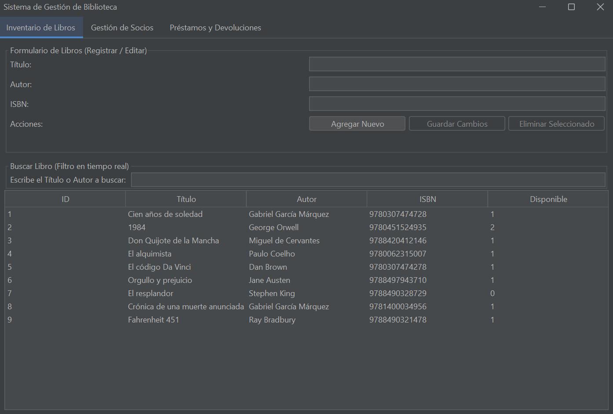
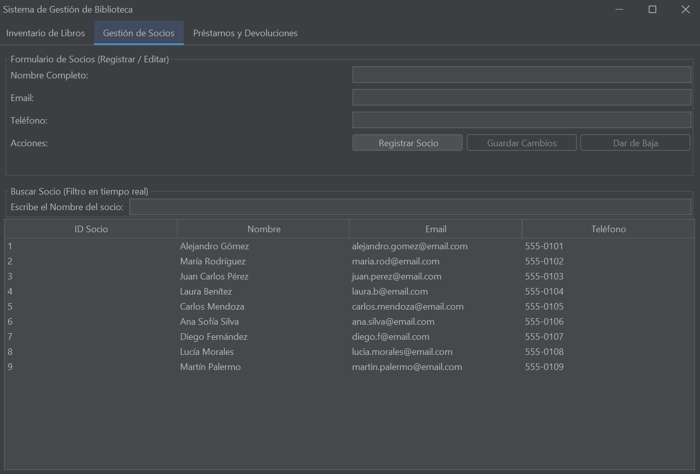
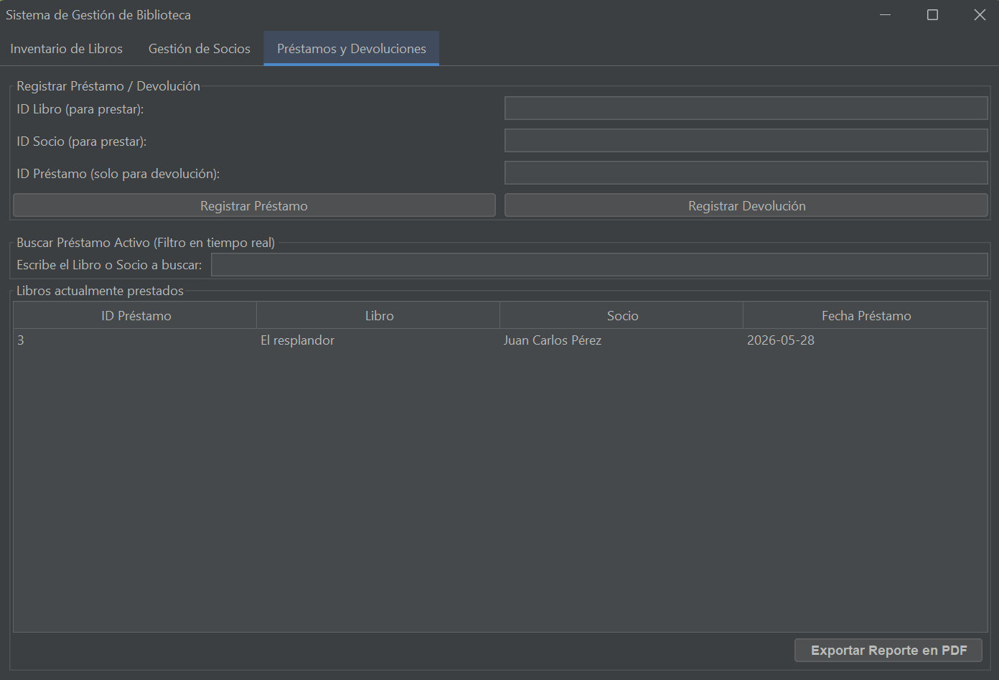

# 📚 Sistema de Gestión de Biblioteca

Este es un sistema de escritorio para la administración y control de una biblioteca, desarrollado en **Java** utilizando una interfaz gráfica moderna. El software permite gestionar el inventario de libros, el registro de socios y el control estricto de préstamos activos y devoluciones, incluyendo la generación automatizada de reportes dinámicos en formato PDF.

<!-- Sección de Capturas de Pantalla -->
<p align="center">
  
  &nbsp;&nbsp;&nbsp;&nbsp;
  
  &nbsp;&nbsp;&nbsp;&nbsp;
  
</p>

---

## 🚀 Características Principales

* **Inventario de Libros (CRUD Completo):** Altas, bajas, modificaciones y consultas de libros con control automático de stock y disponibilidad en tiempo real.
* **Gestión de Socios (CRUD Completo):** Registro y control de usuarios de la biblioteca, validando que no tengan deudas pendientes antes de ser dados de baja.
* **Módulo de Préstamos y Devoluciones:** * Validación automática de disponibilidad de stock.
    * Restricción de seguridad que impide a un socio llevar más de 3 libros simultáneamente.
* **Buscadores en Tiempo Real:** Filtros dinámicos basados en texto (a medida que escribes) en las pestañas de Libros, Socios y Préstamos.
* **Reportes PDF Inteligentes:** Exportación de reportes limpios y profesionales usando **iTextPDF**. El reporte se adapta automáticamente a los filtros aplicados en pantalla.
* **Interfaz Moderna:** Estilo visual elegante y profesional (Modo Oscuro) integrado mediante **FlatLaf**.

---

## 🛠️ Tecnologías y Librerías Utilizadas

* **Lenguaje:** Java 17 / 21
* **Entorno Gráfico:** Java Swing & AWT
* **Base de Datos:** MySQL (Persistencia mediante JDBC y el patrón DAO)
* **Librerías Externas (.JAR):**
    * `com.formdev.flatlaf` (FlatDarkLaf para el diseño visual de la interfaz)
    * `com.itextpdf` (iText v5.x para la creación y manipulación del documento PDF)
    * `mysql-connector-j` (Driver de conexión oficial para la base de datos MySQL)

---

## 📁 Estructura del Proyecto

El proyecto sigue una arquitectura limpia dividida en capas para separar las responsabilidades de forma ordenada:

```text
src/
├── config/
│   └── Conexion.java         # Gestión y apertura de enlaces con MySQL
├── dao/
│   ├── LibroDAO.java         # Consultas SQL para persistencia de libros
│   ├── SocioDAO.java         # Consultas SQL para persistencia de socios
│   └── PrestamoDAO.java      # Lógica transaccional de préstamos y deudas
├── model/
│   ├── Libro.java            # Clase Entidad/Molde para los libros
│   └── Socio.java            # Clase Entidad/Molde para los socios
└── view/
    └── VentanaPrincipal.java # Interfaz gráfica de usuario (Componentes, Listeners y PDF)
```

---

## ⚙️ Requisitos Previos e Instalación

1. **Clonar el repositorio:**
```text
git clone [https://github.com/Maicol843/Sistema-de-Gestion-de-Biblioteca.git](https://github.com/Maicol843/Sistema-de-Gestion-de-Biblioteca.git)
```
2. **Base de Datos:** Asegúrate de tener un servidor MySQL activo (por ejemplo, usando XAMPP o WampServer).
Crea una base de datos llamada biblioteca (o el nombre especificado en tu archivo config/Conexion.java).
Importa el script estructurado que contenga las tablas de libro, socio y prestamo.

3. **Configuración en el Entorno de Desarrollo (IDE):** Si utilizas Visual Studio Code, asegúrate de añadir las librerías necesarias (.jar) en la sección Referenced Libraries
dentro de la pestaña del proyecto Java para evitar errores de compilación con las fuentes (Font) e interfaces gráficas.

---

## 👤 Autor

Maicol Daniel Mamani Chalco - https://github.com/Maicol843/
